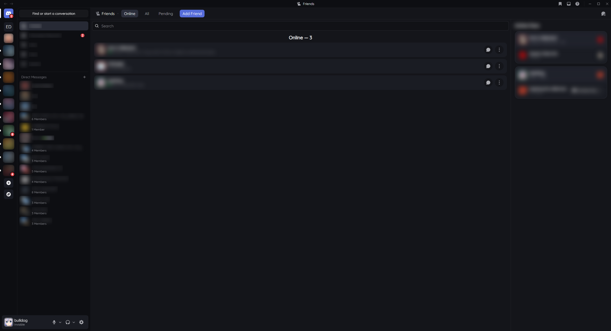
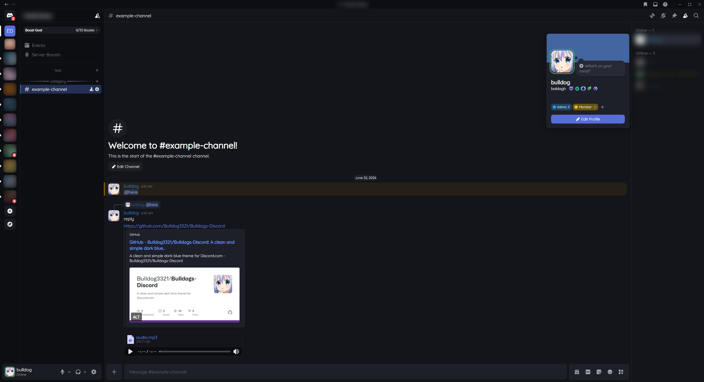

# Bulldogs-Discord
A clean and simple dark blue theme for Discord.com

> [!WARNING] Discontinuation Notice
> Since I don't use discord much anymore, this theme is currently a shell of it's former glory and will no longer recieve major support or feature updates. Occasional maintenence and small additions will likely continue.

## Installation
<details>
<summary>Universal CSS import</summary>

Paste at the very top of your CSS editor
```
@import url("https://bulldog3321.github.io/Bulldogs-Discord/main.css");
```
</details>

<details>
<summary>Stylus</summary>

[Click here to install](https://bulldog3321.github.io/Bulldogs-Discord/Bulldogs-Discord.user.css) 
> Must enable "Patch CSP to allow style assets" in Stylus settings or parts of the theme may fail to load <sup>[1](https://github.com/openstyles/stylus/wiki/FAQ#why-doesnt-my-style-that-loads-external-css-files-work)</sup>
</details>

## Images

